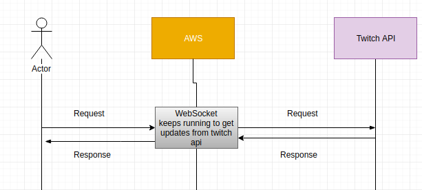

##### How would you deploy the above on AWS? (ideally a rough architecture diagram will help)

##### Where do you see bottlenecks in your proposed architecture and how would you approach scaling this app starting from 100 reqs/day to 900MM reqs/day over 6 months?

The server might get exhausted(possible memory leak) because we have only one server processing the request.  
What we can do with this bottleneck is add additional servers and a load balancer server that will act as a
middleware to these servers.